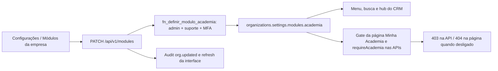
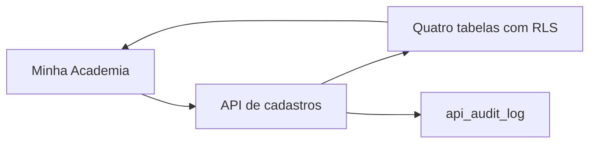
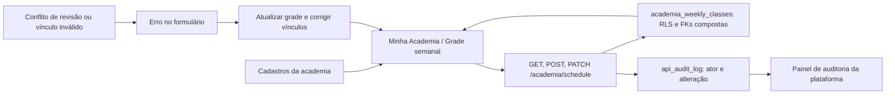
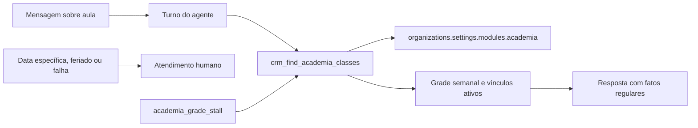

# Academia opcional por empresa

Entregas atuais: ativação por administrador, navegação, fronteira de acesso, cadastros básicos,
grade semanal de referência e consulta estruturada dessa grade pela IA. Exceções por data e
preços entram nas próximas entregas.

Ausência ou valor inválido equivale a desligado, inclusive para administrador de plataforma.
A API resolve organização pela sessão, não pelo body. O merge SQL atômico preserva outras
configurações e os dados da academia. Nenhuma remoção ocorre ao desligar.
Navegação não substitui autorização: página e API consultam a flag a cada requisição.
Foco e polling atualizam outras abas. Não há cache global de autorização.

Entrada: switch em Configurações, visível a admin. Saídas: menu/hub/busca, API e tela.
Retorno da falha: erro de salvamento visível, nenhuma promessa de sucesso sem resposta;
admin pode reler e retentar. Audit registra ator, empresa e valor da flag.
Testes: modules-academia (unit e PostgreSQL), require-academia e academia-modulo-local (browser).
O módulo também controla a primeira ferramenta de Academia da IA: desligado, o handler
`crm_find_academia_classes` falha fechado antes de ler ou devolver qualquer catálogo.

## Cadastros básicos (0234)

`lib/academia/catalogs.ts` define o contrato; `app/app/academia/_catalogs.tsx` o edita. A API
`/api/v1/academia/catalogs/[kind]` aceita audiences, modalities, teachers e spaces. GET paginado
por UUID (50 por página); POST exige Idempotency-Key UUID, usado como identidade durável do registro.
Retries com mesma identidade e mesmos valores retornam o registro; identidade reutilizada com valores
alterados gera conflito. PATCH exige id e revision, com comparação atômica e incremento pelo banco.

`academia_audiences`, `academia_modalities`, `academia_teachers`, `academia_spaces` pertencem à organização.
RLS exige módulo ligado e vínculo válido. Escrita exige manager, suporte de escrita e MFA comprovada
quando aplicável. Usuário não pode mudar tenant, identidade, criação ou revisão diretamente. Não há
DELETE concedido; active=false preserva histórico. API audita academia_catalog.created/updated.

Públicos aceitam limites vazios como não informados; age_pending começa true. Nenhuma faixa, professor
ou modalidade é cadastrada automaticamente. Aliases são nomes alternativos locais da modalidade e a
consulta da IA os resolve por igualdade normalizada. FKs da grade usam organização + id.

Laço de retorno: erro permanece no formulário; falha de rede permite retry sem duplicação. Revisão
conflitante exige fechar, atualizar a lista e reabrir. A lista revalida ao voltar à tela e após salvar;
falha na lista é mostrada explicitamente. Nenhum envio WhatsApp ou ferramenta de IA nesta entrega.

Tipos de `lib/database.types.ts` para os novos objetos gerados pelo Supabase CLI 2.117.0 a partir da migration aplicada; demais declarações preservadas.

## Grade semanal (0235)

CONFIRMADO pelo contrato `lib/academia/schedule.ts`, API `/api/v1/academia/schedule`
e migration 0235: uma aula vincula modalidade, público, professor e ambiente da mesma
organização, com dia ISO (1=segunda, 7=domingo), início local HH:mm e duração em minutos.
O término é calculado e indica virada de dia. Não representa instante UTC nem ocorrência
datada. Nenhuma faixa etária, equivalência, duração ou aula real é presumida.

Leitura depende do módulo ligado e do vínculo com a empresa; escrita exige manager,
suporte com escrita e prova de MFA quando aplicável, também no banco. FKs compostas
proíbem referências a outra empresa. INSERT e troca de vínculo exigem cadastros ativos;
reativação da aula revalida os quatro. Desativar um cadastro não apaga nem altera a aula
existente: a tela sinaliza o vínculo inativo para revisão. Não há exclusão por horário:
simultaneidade é permitida pelo roadmap.

POST usa Idempotency-Key UUID como identidade durável (mesmo padrão de cadastros);
retry de valores iguais não duplica nem audita novamente, mesmo após desativar um vínculo.
Reutilizar a chave com outros valores gera 409. PATCH exige id + revision e faz comparação
atômica no banco. Horários TIME retornam em precisão de minuto. GET pagina por UUID,
50 linhas por página; a tela lê todas as páginas antes de agrupar por dia e filtrar.

Living System Checklist: entrada = quatro cadastros; saída = grade consultável na tela e pela IA;
atividades = academia_schedule.created/updated, com ator, data e identidade no painel de
auditoria; porta = registro existente Minha Academia, abas Grade semanal e Cadastros;
configuração = formulário de aula; anti-morte = aviso de cadastros ausentes/inativos,
erros explícitos e releitura por foco/Atualizar grade; retorno = conflito impede sobrescrita
e exige releitura/correção. A continuidade IA↔humano da consulta está descrita abaixo.

Escopo desta entrega: referência semanal editável e preservação por desativação. Ainda
não implementa cancelamento de ocorrência, alteração de série futura, feriados, publicação
de rascunhos ou consulta por data. A tela informa esse limite; não usar esta referência
sozinha para prometer funcionamento em uma data ou feriado.

## Consulta da grade pela IA

`crm_find_academia_classes` lê diretamente a grade semanal vigente da organização do
turno. Resolve nome ou alias, filtra dia, período e público e projeta somente os fatos
adequados ao cliente. Toda consulta service-role leva `organization_id` explícito;
módulo desligado falha fechado. Observações, capacidade, vagas e UUIDs não chegam ao modelo.

A ferramenta aparece apenas quando publicada em `ai_agent_versions.tool_ids`. O runtime
mantém uma instrução residente, identifica sinal de grade nas seis mensagens mais recentes
e registra se a consulta realmente executou no turno. Nesse contexto, o gate
`academia_grade_stall` veta tanto a promessa vazia de “vou verificar” quanto a afirmação de
horário sem lastro. Conversas sem sinal de grade e agentes sem a capacidade não armam o gate.

A grade é recorrente, não uma agenda de ocorrências. Pedido por data específica, feriado,
cancelamento ou substituição segue para atendimento humano. Uma futura cópia no RAG poderá
ajudar descoberta narrativa, mas será uma derivação atualizada após mudanças e reconciliada
periodicamente; horário, professor e ambiente continuam confirmados pela consulta direta.
