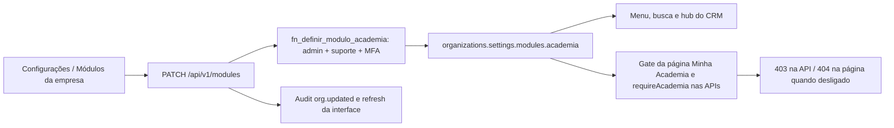

# Academia opcional por empresa

Primeira entrega: ativação por administrador, navegação e fronteira de acesso.
Cadastros, grade, preços e ferramentas de consulta da IA entram nas próximas entregas.

Ausência ou valor inválido equivale a desligado, inclusive para administrador de plataforma.
A API resolve organização pela sessão, não pelo body. O merge SQL atômico preserva outras
configurações e os dados da academia. Nenhuma remoção ocorre ao desligar.
Navegação não substitui autorização: página e API consultam a flag a cada requisição.
Foco e polling atualizam outras abas. Não há cache global de autorização.

Entrada: switch em Configurações, visível a admin. Saídas: menu/hub/busca, API e tela.
Retorno da falha: erro de salvamento visível, nenhuma promessa de sucesso sem resposta;
admin pode reler e retentar. Audit registra ator, empresa e valor da flag.
Testes: modules-academia (unit e PostgreSQL), require-academia e academia-modulo-local (browser).
O gate de ferramentas da IA será aplicado quando as primeiras ferramentas de academia
forem criadas; esta entrega não registra ferramentas nem altera prompts do CRM.
