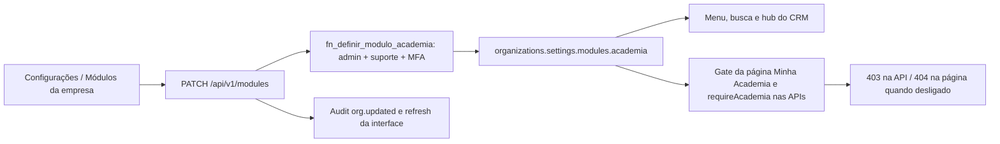
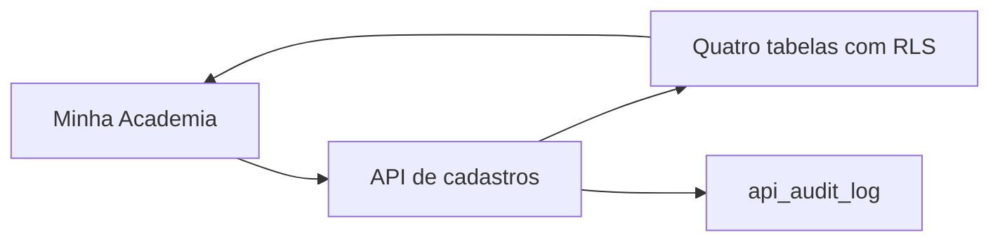

# Academia opcional por empresa

Entregas atuais: ativação por administrador, navegação, fronteira de acesso e cadastros básicos.
Grade, preços e ferramentas de consulta da IA entram nas próximas entregas.

Ausência ou valor inválido equivale a desligado, inclusive para administrador de plataforma.
A API resolve organização pela sessão, não pelo body. O merge SQL atômico preserva outras
configurações e os dados da academia. Nenhuma remoção ocorre ao desligar.
Navegação não substitui autorização: página e API consultam a flag a cada requisição.
Foco e polling atualizam outras abas. Não há cache global de autorização.

Entrada: switch em Configurações, visível a admin. Saídas: menu/hub/busca, API e tela.
Retorno da falha: erro de salvamento visível, nenhuma promessa de sucesso sem resposta;
admin pode reler e retentar. Audit registra ator, empresa e valor da flag.
Testes: modules-academia (unit e PostgreSQL), require-academia e academia-modulo-local (browser).
O gate de ferramentas da IA será aplicado quando as primeiras ferramentas de academia
forem criadas; esta entrega não registra ferramentas nem altera prompts do CRM.

## Cadastros básicos (0234)

`lib/academia/catalogs.ts` define o contrato; `app/app/academia/_catalogs.tsx` o edita. A API
`/api/v1/academia/catalogs/[kind]` aceita audiences, modalities, teachers e spaces. GET paginado
por UUID (50 por página); POST exige Idempotency-Key UUID, usado como identidade durável do registro.
Retries com mesma identidade e mesmos valores retornam o registro; identidade reutilizada com valores
alterados gera conflito. PATCH exige id e revision, com comparação atômica e incremento pelo banco.

`academia_audiences`, `academia_modalities`, `academia_teachers`, `academia_spaces` pertencem à organização.
RLS exige módulo ligado e vínculo válido. Escrita exige manager, suporte de escrita e MFA comprovada
quando aplicável. Usuário não pode mudar tenant, identidade, criação ou revisão diretamente. Não há
DELETE concedido; active=false preserva histórico. API audita academia_catalog.created/updated.

Públicos aceitam limites vazios como não informados; age_pending começa true. Nenhuma faixa, professor
ou modalidade é cadastrada automaticamente. Aliases são nomes alternativos locais da modalidade;
a resolução desses nomes no agente ainda não existe. FKs da grade deverão usar organização + id.

Laço de retorno: erro permanece no formulário; falha de rede permite retry sem duplicação. Revisão
conflitante exige fechar, atualizar a lista e reabrir. A lista revalida ao voltar à tela e após salvar;
falha na lista é mostrada explicitamente. Nenhum envio WhatsApp ou ferramenta de IA nesta entrega.

Tipos de `lib/database.types.ts` para os novos objetos gerados pelo Supabase CLI 2.117.0 a partir da migration aplicada; demais declarações preservadas.
