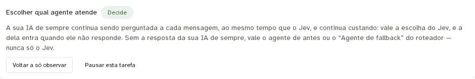
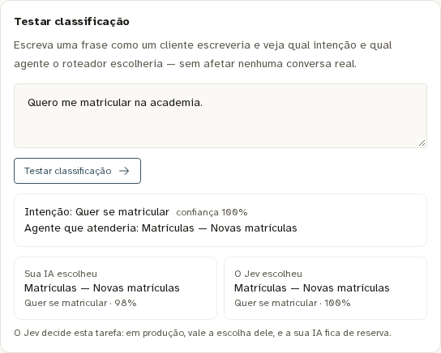

# Revalidação na última versão estável: v1.64.1 + contexto Jev

Em 29/09/2026 (America/Sao_Paulo; 30/09 UTC), a mesma instalação piloto foi atualizada da base v1.58.1 para a **v1.64.1**, última release estável confirmada na API do GitHub ao término da operação. A implementação deste PR e os patches de marca foram preservados.

- Base oficial: [v1.64.1](https://github.com/melgarafael/DeskcommCRM/releases/tag/v1.64.1).
- Imagens de app, worker e scheduler: commit `6a2a8b0634d2b85c92d8c66fbc79be8d93518a28`, publicadas pelo [CI](https://github.com/vitorlacerdadigital/DeskcommCRM/actions/runs/36657475793), todas com a mesma revisão e fixadas por digest. As oito fontes executáveis do Jev/roteamento/consentimento continuam idênticas às do PR: [hashes conferidos no worker](source-hashes.json).
- Banco atualizado pelo bloco de aplicação/conferência do kit da versão nova, com backup prévio e serviços pausados. Uma passagem, sem erro, e 158 regras de isolamento declaradas conferidas. Conferidos também os objetos novos de propostas, grupos e índice de deduplicação da release. TLS até o pooler verificado no socket do cliente: encrypted=true, authorized=true.
- Contagens de dados existentes, marca, fotos do catálogo e roteadores preservados. A configuração `jev`, incluindo aceite do histórico e estado das tarefas, permaneceu idêntica. O baseline acrescentou somente `settings.proposals` desativado onde estava ausente.

## APIs reais depois da atualização

Oito casos idênticos aos da rodada anterior, com `jev-1.13.0` e `claude-sonnet-5` reais:

- **Jev: 8/8; classificador convencional: 8/8.** Mediana reportada pelo cliente Jev: **250 ms** nesta rodada.
- Continua sendo uma amostra sintética pequena, com uma execução por caso, não uma estimativa de acurácia geral.
- [Casos e resultados](depois.json).

O `resolveConversationTurn` foi executado novamente no worker/banco instalados: resultado `classified`, intenção “Visita ou aula experimental”, agente sintético publicado e origem `jev`. Recebeu quatro mensagens anteriores em ordem e a atual “Sim” separada, excluiu a mensagem fora da janela e mascarou telefone/e-mail fictícios. [Resultado](runtime.json).

As fixtures transacionais foram revertidas; os custos das APIs reais ficaram contabilizados como teste. Nenhum envio pelo canal. A pendência do agente comercial sem versão publicada continua separada desta melhoria; não foi publicado pelo teste.

## Interface e preservação da configuração

Login real e Inbox passaram, sem erro de JavaScript. Estado final da interface:

A mesma frase crua foi testada pela tela e diretamente pela API, com concordância na intenção e JEV decidindo: [respostas](tela-api.json).

## Verificações e limite operacional

233 testes selecionados passaram na base integrada (Jev, configuração, resolvedor, API, cartão e manifest). A suíte shell completa da árvore de build passou usando jq 1.8.1. Na VPS, jq 1.6 falhava no teste de arquivo vazio; na árvore privada, a personalização preexistente de CA também altera deliberadamente o comando esperado por um teste do kit. Esses resultados foram identificados, não apresentados como uma suíte privada integral verde.

Uma primeira tentativa de executar três processos auxiliares simultâneos no worker excedeu seu limite de 512 MiB e provocou um reinício. Os testes foram refeitos **sequencialmente**, passaram e não houve novo reinício nesse recorte. O estado final dos três serviços é saudável. Esta rodada valida funcionalidade; não é ensaio de carga nem prova de atendimento completo por WhatsApp.
