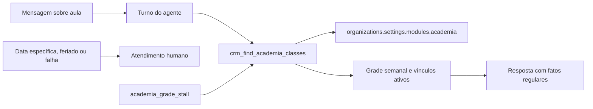

# Academia · Consulta da Grade pela IA Implementation Plan

> **For agentic workers:** REQUIRED SUB-SKILL: Use superpowers:subagent-driven-development (recommended) or superpowers:executing-plans to implement this plan task-by-task. Steps use checkbox (`- [ ]`) syntax for tracking.

**Goal:** Fazer o agente consultar a grade semanal vigente da própria organização e responder imediatamente perguntas como “CrossFit na segunda-feira pela manhã”, sem promessas vazias de consulta.

**Architecture:** Regras puras normalizam termos, resolvem aliases, classificam períodos e projetam aulas sem campos internos. Uma tool MCP read-only consulta o Postgres com `organization_id` explícito em todas as leituras; o runtime injeta instrução residente e arma um gate próprio quando a conversa recente indica grade. O banco continua sendo a autoridade, sem cópia RAG ou schema novo nesta etapa.

**Tech Stack:** TypeScript 6 estrito, Zod 4, Supabase/PostgREST, Vercel AI SDK, Vitest 4, pnpm 9.15.9, Node 22.

## Global Constraints

- Fonte de verdade: `academia_weekly_classes`; RAG não confirma horário, professor, ambiente ou ocorrência.
- Períodos: manhã `<12:00`, tarde `12:00–17:59`, noite `>=18:00`, pelo início da aula.
- Nome e alias usam NFD sem acentos, minúsculas, pontuação como espaço e sem fuzzy match.
- Toda leitura service-role filtra `organization_id` de `McpContext`; input nunca aceita tenant.
- Somente aula e vínculos ativos saem como oferta atual.
- Professor normalizado como `a definir` preserva a aula e gera `pendencias: ["professor"]`.
- Observações livres, capacidade nominal, UUIDs, vagas e reservas não chegam ao modelo.
- Data civil específica ou feriado não é confirmado pela grade semanal e segue para handoff.
- Tool: `crm_find_academia_classes`, categoria `read`, papel `agent`, scope `mcp:read`.
- Módulo Academia desligado falha fechado.
- Não haverá migration, mudança em `supabase/baseline.sql` ou edição de `lib/database.types.ts`.
- O trabalho fica no worktree `/home/marlon/projects/deskcomm-academia-grade`, branch `feature/academia-grade`.

---

## File Map

- Create `lib/academia/consulta-grade.ts`: regras puras e tipos da resposta pública.
- Create `tests/unit/academia-consulta-grade.test.ts`: normalização, resolução, períodos, sinal e projeção.
- Create `lib/mcp/tools/academia.ts`: contrato e handler tenant-aware.
- Create `lib/mcp/tools/catalogo/academia.ts`: catálogo client-safe para o editor.
- Modify `lib/mcp/tools/index.ts` and `lib/mcp/tools/catalogo/index.ts`: agregar as duas metades.
- Modify `lib/ai/agents/capacidades-padrao.ts` and
  `lib/ai/agents/first-publication.ts`: não ligar capacidade de Academia no
  onboarding de organização sem o módulo.
- Create `tests/unit/mcp-academia-grade.test.ts`: comportamento e isolamento da tool.
- Modify `tests/unit/capacidades-padrao-do-onboarding.test.ts`: seleção condicionada ao módulo.
- Modify `lib/agent-engine/guardrails/before-send.ts`: gate `academia_grade_stall` e versão da cadeia.
- Create `tests/unit/gate-academia-grade-stall.test.ts`: decisão e fiação do gate.
- Modify `tests/unit/before-send-chain-shape.test.ts`: ordem, tamanho e versão.
- Modify `lib/agent-engine/agent/inbound-turn.ts`: prompt residente, sinal e execução da tool.
- Modify `lib/agent-engine/agent/preview.ts` and `preview.test.ts`: paridade da prévia.
- Modify `docs/architecture/academia.md` and the approved design: living architecture.
- Create `.changes/academia-ia-consulta-grade.md`: nota para o operador.

---

### Task 1: Regras puras da grade semanal

**Status:** concluída em `f68edf6a`.

**Files:**
- Create: `lib/academia/consulta-grade.ts`
- Test: `tests/unit/academia-consulta-grade.test.ts`

**Interfaces:**
- Produces: `PeriodoAcademia`, `normalizarTermoAcademia`, `periodoDoInicio`, `resolverModalidade`, `resolverPublico`, `sinalDeConversaSobreGrade`, `projetarAulaSemanal`.
- Consumes: `formatClassEnd` and `weekdays` from `lib/academia/schedule.ts`.

- [ ] **Step 1: Write the failing domain tests**

```ts
import { describe, expect, it } from "vitest";
import {
  normalizarTermoAcademia,
  periodoDoInicio,
  projetarAulaSemanal,
  resolverModalidade,
  sinalDeConversaSobreGrade,
} from "@/lib/academia/consulta-grade";

describe("consulta da grade da academia", () => {
  const modalidades = [
    { id: "m1", name: "CrossFit", aliases: ["Cross fit", "Cross"] },
    { id: "m2", name: "Ciclismo", aliases: ["Spinning"] },
  ];

  it("resolve nomes e aliases normalizados", () => {
    expect(normalizarTermoAcademia("  São-João! ")).toBe("sao joao");
    expect(resolverModalidade(modalidades, "cross-fit")).toMatchObject({ tipo: "encontrada", id: "m1" });
    expect(resolverModalidade(modalidades, "SPÍNNING")).toMatchObject({ tipo: "encontrada", id: "m2" });
  });

  it("não escolhe alias ausente ou ambíguo", () => {
    expect(resolverModalidade(modalidades, "Natação")).toEqual({ tipo: "nao_encontrada" });
    expect(resolverModalidade([
      { id: "m1", name: "CrossFit", aliases: ["Treino"] },
      { id: "m2", name: "Funcional", aliases: ["Treino"] },
    ], "Treino")).toEqual({ tipo: "ambigua", nomes: ["CrossFit", "Funcional"] });
  });

  it.each([["11:59", "manha"], ["12:00", "tarde"], ["17:59", "tarde"], ["18:00", "noite"]] as const)(
    "classifica %s como %s", (inicio, esperado) => expect(periodoDoInicio(inicio)).toBe(esperado),
  );

  it("projeta CrossFit sem id ou observações e marca professor pendente", () => {
    expect(projetarAulaSemanal(
      { id: "interno", weekday: 1, start_time: "08:00:00", duration_minutes: 60 },
      { modalidade: "CrossFit", publico: "Adulto", professor: "A definir", ambiente: "Box" },
    )).toEqual({
      dia_semana: 1, dia: "Segunda-feira", inicio: "08:00", fim: "09:00",
      duracao_minutos: 60, publico: "Adulto", professor: "A definir", ambiente: "Box",
      pendencias: ["professor"],
    });
  });

  it("reconhece grade no histórico sem confundir rastreio", () => {
    expect(sinalDeConversaSobreGrade([{ direction: "inbound", body: "Cross fit" }])).toBe(true);
    expect(sinalDeConversaSobreGrade([{ direction: "inbound", body: "Verifique meu pedido" }])).toBe(false);
  });
});
```

- [ ] **Step 2: Verify red**

Run: `pnpm exec vitest run tests/unit/academia-consulta-grade.test.ts`

Expected: FAIL porque o módulo ainda não existe.

- [ ] **Step 3: Implement the complete pure module**

```ts
import { formatClassEnd, weekdays } from "./schedule";

export type PeriodoAcademia = "manha" | "tarde" | "noite";
export type ItemNome = { id: string; name: string };
export type ItemModalidade = ItemNome & { aliases: string[] };

export function normalizarTermoAcademia(texto: string): string {
  return texto.normalize("NFD").replace(/[\u0300-\u036f]/g, "")
    .toLocaleLowerCase("pt-BR").replace(/[^a-z0-9]+/g, " ").trim().replace(/\s+/g, " ");
}

export function periodoDoInicio(inicio: string): PeriodoAcademia {
  const minutos = Number(inicio.slice(0, 2)) * 60 + Number(inicio.slice(3, 5));
  return minutos < 720 ? "manha" : minutos < 1080 ? "tarde" : "noite";
}

export function resolverModalidade(itens: readonly ItemModalidade[], termo: string) {
  const alvo = normalizarTermoAcademia(termo);
  const nomes = itens.filter((item) => normalizarTermoAcademia(item.name) === alvo);
  const encontrados = nomes.length > 0 ? nomes : itens.filter((item) =>
    item.aliases.some((alias) => normalizarTermoAcademia(alias) === alvo));
  if (encontrados.length === 0) return { tipo: "nao_encontrada" as const };
  if (encontrados.length > 1)
    return { tipo: "ambigua" as const, nomes: encontrados.map((item) => item.name).sort() };
  return { tipo: "encontrada" as const, id: encontrados[0]!.id, nome: encontrados[0]!.name };
}

export function resolverPublico(itens: readonly ItemNome[], termo: string): ItemNome | null {
  const alvo = normalizarTermoAcademia(termo);
  return itens.find((item) => normalizarTermoAcademia(item.name) === alvo) ?? null;
}

const TERMOS_DE_GRADE = /\b(grade|aula|aulas|modalidade|turma|treino|cross ?fit|spinning|ciclismo|pilates|yoga|musculacao|professor|professora|box)\b/i;
export function sinalDeConversaSobreGrade(mensagens: readonly { direction: string; body: string }[]): boolean {
  return TERMOS_DE_GRADE.test(normalizarTermoAcademia(mensagens.slice(-6).map((m) => m.body).join(" ")));
}

export function projetarAulaSemanal(
  aula: { id: string; weekday: number; start_time: string; duration_minutes: number },
  vinculos: { modalidade: string; publico: string; professor: string; ambiente: string },
) {
  const inicio = aula.start_time.slice(0, 5);
  const pendente = normalizarTermoAcademia(vinculos.professor) === "a definir";
  return {
    dia_semana: aula.weekday,
    dia: weekdays.find((item) => item.value === aula.weekday)!.label,
    inicio,
    fim: formatClassEnd(inicio, aula.duration_minutes),
    duracao_minutos: aula.duration_minutes,
    publico: vinculos.publico,
    professor: vinculos.professor,
    ambiente: vinculos.ambiente,
    ...(pendente ? { pendencias: ["professor"] } : {}),
  };
}
```

- [ ] **Step 4: Verify green and commit**

Run: `pnpm exec vitest run tests/unit/academia-consulta-grade.test.ts`

Expected: PASS.

```bash
git add lib/academia/consulta-grade.ts tests/unit/academia-consulta-grade.test.ts
git commit -m "feat(academia): define consulta semanal para a IA"
```

### Task 2: Tool MCP tenant-aware e catálogo

**Status:** concluída em `43fab94f`.

**Files:**
- Create: `lib/mcp/tools/academia.ts`
- Create: `lib/mcp/tools/catalogo/academia.ts`
- Modify: `lib/mcp/tools/index.ts`
- Modify: `lib/mcp/tools/catalogo/index.ts`
- Modify: `lib/ai/agents/capacidades-padrao.ts`
- Modify: `lib/ai/agents/first-publication.ts`
- Test: `tests/unit/mcp-academia-grade.test.ts`
- Test: `tests/unit/capacidades-padrao-do-onboarding.test.ts`

**Interfaces:**
- Consumes: helpers da Task 1, `lerModulos(settings)`, `ApiError`, `McpToolDefinition`.
- Produces: `crmFindAcademiaClasses` and `TOOLS_ACADEMIA` under wire id `crm_find_academia_classes`.
- Produces: `capacidadesPadraoDoOnboarding({ academia: boolean })`; a chamada
  de primeira publicação passa `lerModulos(org?.settings)`.
- Private contracts: `respostaDaResolucao(resolucao, input)`,
  `respostaPublicoAusente(nomeModalidade, input)` and
  `respostaComAulas(nomeModalidade, input, linhas, publicos, ctx)` all return
  `Promise<AcademiaClassSearchResult> | AcademiaClassSearchResult`; the result
  union declares `motivo` only as `modalidade_nao_encontrada`,
  `modalidade_ambigua` or `publico_nao_encontrado`.

- [ ] **Step 1: Write failing handler tests**

Criar um dublê encadeável em que `from(table)` devolve resultados roteados por tabela e registra cada `.eq`. Cobrir:

```ts
it("responde CrossFit de segunda de manhã sem ids, notes ou capacidade", async () => {
  const result = await crmFindAcademiaClasses.handler(
    { modalidade: "Cross fit", dia_semana: 1, periodo: "manha", limite: 10 },
    contextoComGradeCrossfit(),
  );
  expect(result).toMatchObject({ tipo_grade: "semanal_regular", modalidade: "CrossFit", total: 1, ha_mais: false });
  expect(JSON.stringify(result)).toContain("08:00");
  expect(JSON.stringify(result)).not.toMatch(/aula-1|Capacidade|notes|observacoes/);
});

it("falha fechado com módulo desligado", async () => {
  await expect(crmFindAcademiaClasses.handler(
    { modalidade: "CrossFit", limite: 10 }, contextoComModulo(false),
  )).rejects.toMatchObject({ code: "module_disabled", status: 403 });
});

it("filtra a organização do contexto em toda tabela", async () => {
  const ctx = contextoComGradeCrossfit();
  await crmFindAcademiaClasses.handler({ modalidade: "CrossFit", limite: 10 }, ctx);
  for (const consulta of consultasExecutadas(ctx))
    expect(consulta.eq).toHaveBeenCalledWith(expect.stringMatching(/^(id|organization_id)$/), "org-1");
});
```

Acrescentar casos para alias ambíguo, modalidade ausente, público ausente, lista vazia, vínculo inativo, `limite + 1` e falha de banco com código estável.

Em `tests/unit/capacidades-padrao-do-onboarding.test.ts`, congelar as duas direções:

```ts
expect(capacidadesPadraoDoOnboarding({ academia: false })).not.toContain("crm_find_academia_classes");
expect(capacidadesPadraoDoOnboarding({ academia: true })).toContain("crm_find_academia_classes");
```

- [ ] **Step 2: Verify red**

Run: `pnpm exec vitest run tests/unit/mcp-academia-grade.test.ts tests/unit/catalogo-servido.test.ts`

Expected: FAIL por tool ausente.

- [ ] **Step 3: Implement the handler**

O arquivo usa este contrato completo de entrada e saída:

```ts
const inputShape = {
  modalidade: z.string().trim().min(1).max(120),
  dia_semana: z.number().int().min(1).max(7).optional(),
  periodo: z.enum(["manha", "tarde", "noite"]).optional(),
  publico: z.string().trim().min(1).max(120).optional(),
  limite: z.number().int().min(1).max(20).optional().default(10),
};

const FAIXAS = {
  manha: { inicio: "00:00", fimExclusivo: "12:00" },
  tarde: { inicio: "12:00", fimExclusivo: "18:00" },
  noite: { inicio: "18:00", fimExclusivo: null },
} as const;

export const crmFindAcademiaClasses: McpToolDefinition<typeof inputShape> = {
  name: "crm_find_academia_classes",
  description: "Consulta a grade semanal regular da academia. Use antes de informar qualquer horário de aula. Passe modalidade, dia ISO e período já ditos pela pessoa; não use a grade para afirmar vaga, reserva, feriado ou ocorrência em uma data específica.",
  inputSchema: inputShape,
  category: "read",
  requiresRole: "agent",
  requiresScope: "mcp:read",
  handler: async (input, ctx) => {
    const org = await ctx.supabase.from("organizations").select("settings")
      .eq("id", ctx.organizationId).maybeSingle();
    if (org.error) throw new Error(`consultar_modulo_academia_falhou: ${org.error.message}`);
    if (!lerModulos(org.data?.settings).academia)
      throw new ApiError(403, "module_disabled", undefined, ctx.requestId, "O módulo Academia está desativado nesta empresa.");

    const mods = await ctx.supabase.from("academia_modalities").select("id,name,aliases")
      .eq("organization_id", ctx.organizationId).eq("active", true).order("name");
    if (mods.error) throw new Error(`consultar_modalidades_falhou: ${mods.error.message}`);
    const modalidade = resolverModalidade(mods.data ?? [], input.modalidade);
    if (modalidade.tipo !== "encontrada") return respostaDaResolucao(modalidade, input);

    const publicos = await ctx.supabase.from("academia_audiences").select("id,name")
      .eq("organization_id", ctx.organizationId).eq("active", true).order("name");
    if (publicos.error) throw new Error(`consultar_publicos_falhou: ${publicos.error.message}`);
    const publico = input.publico ? resolverPublico(publicos.data ?? [], input.publico) : null;
    if (input.publico && !publico) return respostaPublicoAusente(modalidade.nome, input);

    let grade = ctx.supabase.from("academia_weekly_classes")
      .select("id,modality_id,audience_id,teacher_id,space_id,weekday,start_time,duration_minutes")
      .eq("organization_id", ctx.organizationId).eq("active", true)
      .eq("modality_id", modalidade.id).order("weekday").order("start_time").limit(input.limite + 1);
    if (input.dia_semana !== undefined) grade = grade.eq("weekday", input.dia_semana);
    if (publico) grade = grade.eq("audience_id", publico.id);
    if (input.periodo) {
      const faixa = FAIXAS[input.periodo];
      grade = grade.gte("start_time", faixa.inicio);
      if (faixa.fimExclusivo) grade = grade.lt("start_time", faixa.fimExclusivo);
    }
    const { data: linhas, error } = await grade;
    if (error) throw new Error(`consultar_grade_academia_falhou: ${error.message}`);

    return respostaComAulas(modalidade.nome, input, linhas ?? [], publicos.data ?? [], ctx);
  },
};
```

`respostaDaResolucao` devolve lista vazia e a mensagem para perguntar o nome ou
desambiguar as opções; `respostaPublicoAusente` devolve lista vazia e pede o público
usado no cadastro. `respostaComAulas` consulta `academia_teachers` e `academia_spaces`
pelos ids das linhas, sempre com organização + `active=true`; reutiliza os públicos
já lidos, descarta qualquer aula sem os três vínculos ativos, ordena por
dia/início/público/professor/id, projeta com `projetarAulaSemanal`, retém somente
`input.limite`, calcula `ha_mais` pela linha seguinte e define `total` como a
quantidade entregue. Cada erro de leitura lança respectivamente
`consultar_professores_falhou` ou `consultar_ambientes_falhou`.

- [ ] **Step 4: Add catalog metadata and aggregates**

```ts
export const TOOLS_ACADEMIA = declararTools([{
  name: "crm_find_academia_classes",
  category: "read",
  rotulo: "Consultar a grade de aulas",
  explicacao: "Consulta dias, horários, público, professor e ambiente diretamente na grade semanal cadastrada da academia.",
  oQueToca: "Grade semanal da academia",
  risco: "seguro",
  pacotes: ["vender"],
}]);
```

Importar/spread `TOOLS_ACADEMIA` em `lib/mcp/tools/catalogo/index.ts`; importar/inserir `crmFindAcademiaClasses` no bloco `read` de `allTools`.

Filtrar a capacidade modular antes de derivar o pacote padrão:

```ts
export interface ModulosDasCapacidadesPadrao { academia: boolean }

export function capacidadesPadraoDoOnboarding(modulos: ModulosDasCapacidadesPadrao): string[] {
  const catalogo = catalogoComHandler().filter((capacidade) =>
    capacidade.name !== "crm_find_academia_classes" || modulos.academia,
  );
  return ligarPacote([], catalogo, PACOTE_PADRAO_DO_ONBOARDING);
}
```

Em `publishFirstVersion`, reutilizar a leitura de `organizations.settings` já
existente e chamar `capacidadesPadraoDoOnboarding(lerModulos(org?.settings))`.

- [ ] **Step 5: Verify and commit**

Run: `pnpm exec vitest run tests/unit/mcp-academia-grade.test.ts tests/unit/capacidades-padrao-do-onboarding.test.ts tests/unit/catalogo-servido.test.ts tests/unit/catalogo-tools-leigo-friendly.test.ts tests/unit/catalogo-nao-corta-cego.test.ts`

Expected: PASS, bijeção catálogo↔handler e pacote dentro do teto.

```bash
git add lib/mcp/tools/academia.ts lib/mcp/tools/catalogo/academia.ts lib/mcp/tools/index.ts lib/mcp/tools/catalogo/index.ts lib/ai/agents/capacidades-padrao.ts lib/ai/agents/first-publication.ts tests/unit/mcp-academia-grade.test.ts tests/unit/capacidades-padrao-do-onboarding.test.ts
git commit -m "feat(academia): expõe a grade semanal à IA"
```

### Task 3: Gate determinístico contra evasão

**Status:** concluída em `d57b208e`.

**Files:**
- Modify: `lib/agent-engine/guardrails/before-send.ts`
- Create: `tests/unit/gate-academia-grade-stall.test.ts`
- Modify: `tests/unit/before-send-chain-shape.test.ts`

**Interfaces:**
- Produces: `academiaGrade?: { active; toolCalledThisTurn }`, `academiaGradeStallGate`, chain v8.
- Consumes: estado calculado pelo runtime na Task 4.

- [ ] **Step 1: Write failing tests from the measured messages**

```ts
it.each([
  "Vou consultar a grade e já te retorno.",
  "Posso verificar isso para você?",
  "Estou verificando e aviso assim que souber.",
])("veta evasão sem execução: %s", (body) => {
  const verdict = academiaGradeStallGate.evaluate(baseCtx({
    body, academiaGrade: { active: true, toolCalledThisTurn: false },
  }));
  expect(verdict.pass).toBe(false);
  if (!verdict.pass) expect(verdict.code).toBe("academia_grade_stall_sem_ferramenta");
});

it("veta horário de aula inventado e libera depois da tool", () => {
  const body = "O CrossFit de segunda é às 08:00.";
  expect(academiaGradeStallGate.evaluate(baseCtx({ body, academiaGrade: { active: true, toolCalledThisTurn: false } })).pass).toBe(false);
  expect(academiaGradeStallGate.evaluate(baseCtx({ body, academiaGrade: { active: true, toolCalledThisTurn: true } })).pass).toBe(true);
});

it("não interfere fora do assunto de grade", () => {
  expect(academiaGradeStallGate.evaluate(baseCtx({
    body: "Vou verificar o rastreio.", academiaGrade: { active: false, toolCalledThisTurn: false },
  })).pass).toBe(true);
});
```

- [ ] **Step 2: Verify red**

Run: `pnpm exec vitest run tests/unit/gate-academia-grade-stall.test.ts tests/unit/before-send-chain-shape.test.ts`

Expected: FAIL por gate ausente e cadeia ainda v7/11.

- [ ] **Step 3: Implement and wire the gate**

```ts
const ACADEMIA_GRADE_STALL_PATTERN =
  /\b(vou|irei|estou|posso|deixa eu)\b[^.!?\n]{0,70}\b(consultar|verificar|checando|checar|confirmar|vendo)\b/i;
const ACADEMIA_GRADE_HOUR_PATTERN =
  /\b(aula|turma|treino|cross ?fit|spinning|ciclismo|pilates|yoga|musculacao)\b[^.!?\n]{0,90}\b([01]\d|2[0-3]):[0-5]\d\b/i;

export const academiaGradeStallGate: Gate = {
  name: "academia_grade_stall",
  evaluate: (ctx) => {
    if (!ctx.academiaGrade?.active || ctx.academiaGrade.toolCalledThisTurn) return { pass: true };
    const body = semAcento(ctx.body);
    if (!ACADEMIA_GRADE_STALL_PATTERN.test(body) && !ACADEMIA_GRADE_HOUR_PATTERN.test(body))
      return { pass: true };
    return {
      pass: false,
      code: "academia_grade_stall_sem_ferramenta",
      reason: "Você adiou ou afirmou um horário de aula sem chamar crm_find_academia_classes neste turno. Chame a ferramenta agora e responda com o retorno. Para data específica ou feriado, faça handoff em vez de confirmar pela grade semanal.",
    };
  },
};
```

Propagar o campo opcional por `RunBeforeSendArgs` e `runBeforeSend`. Inserir o gate depois de `agendaStallGate` e antes de `disclosureGate`; atualizar comentário, `BEFORE_SEND_CHAIN_VERSION = 8`, tamanho esperado `12` e a ordem congelada.

- [ ] **Step 4: Verify green and commit**

Run: `pnpm exec vitest run tests/unit/gate-academia-grade-stall.test.ts tests/unit/gate-agenda-stall.test.ts tests/unit/before-send-chain-shape.test.ts`

Expected: PASS sem mudar o gate de agenda.

```bash
git add lib/agent-engine/guardrails/before-send.ts tests/unit/gate-academia-grade-stall.test.ts tests/unit/before-send-chain-shape.test.ts
git commit -m "fix(academia): impede promessa de consultar sem consultar"
```

### Task 4: Turno real, prompt residente e prévia

**Status:** concluída em `9bd8122e`.

**Files:**
- Modify: `lib/agent-engine/agent/inbound-turn.ts`
- Modify: `lib/agent-engine/agent/preview.ts`
- Modify: `lib/agent-engine/agent/preview.test.ts`
- Modify: `tests/unit/gate-academia-grade-stall.test.ts`

**Interfaces:**
- Consumes: `sinalDeConversaSobreGrade`, tool id e contexto da Task 3.
- Produces: `ACADEMIA_GRADE_SYSTEM_BLOCK`, flag de execução real e paridade de preview.

- [ ] **Step 1: Add failing structural and preview tests**

```ts
expect(FONTE_INBOUND).toMatch(/toolIds\.includes\('crm_find_academia_classes'\)/);
expect(FONTE_INBOUND).toContain("ACADEMIA_GRADE_SYSTEM_BLOCK");
expect(FONTE_INBOUND).toMatch(/active:\s*academiaGradeRequestActive/);
expect(FONTE_INBOUND).toMatch(/toolCalledThisTurn:\s*academiaGradeToolCalledThisTurn/);
expect(FONTE_INBOUND).toMatch(/academiaGradeToolCalledThisTurn = true/);
expect(FONTE_INBOUND).toMatch(/data específica|data especifica/);
expect(FONTE_INBOUND).toContain("request_human_handoff");
```

Na prévia, tentar enviar “Vou consultar a grade” antes da tool deve gerar impedimento; executar `crm_find_academia_classes` e enviar “O CrossFit de segunda é às 08:00” deve gerar candidata.

- [ ] **Step 2: Verify red**

Run: `pnpm exec vitest run tests/unit/gate-academia-grade-stall.test.ts lib/agent-engine/agent/preview.test.ts`

Expected: FAIL porque o estado ainda não chega ao gate.

- [ ] **Step 3: Add the resident block and conversation signal**

```ts
const ACADEMIA_GRADE_SYSTEM_BLOCK =
  "## Grade semanal da academia — consulte antes de responder\n" +
  "Quando a pessoa perguntar dia, horário, público, professor ou ambiente de uma aula, chame crm_find_academia_classes antes de responder. Reutilize modalidade, dia e período já ditos no histórico; não pergunte de novo. Responda primeiro os fatos confirmados. Professor ‘A definir’ não apaga o horário: só transfira se a pessoa pedir justamente quem ministra. A grade é semanal regular: não afirme vaga, reserva, feriado ou ocorrência em data específica. Para data específica ou falha da ferramenta, use request_human_handoff e explique o limite sem prometer consulta futura.";

if (agentConfig?.toolIds.includes("crm_find_academia_classes"))
  blocosResidentes.push(ACADEMIA_GRADE_SYSTEM_BLOCK);

const academiaGradeRequestActive =
  agentConfig?.toolIds.includes("crm_find_academia_classes") === true &&
  sinalDeConversaSobreGrade(effectiveContext.messages);
let academiaGradeToolCalledThisTurn = false;
```

- [ ] **Step 4: Mark execution and pass live state**

```ts
const ACADEMIA_GRADE_TOOL_NAMES = new Set(["crm_find_academia_classes"]);

// No wrapper MCP:
academiaGradeToolCalledThisTurn = true;
return executeOriginal(...args);

// Em send_message e no callback liveContext da prévia:
academiaGrade: {
  active: academiaGradeRequestActive,
  toolCalledThisTurn: academiaGradeToolCalledThisTurn,
},
```

Adicionar `crm_find_academia_classes` a `SCENARIO_READS`; em `previewGateContext`, combinar presença da tool e `sinalDeConversaSobreGrade(p.context.context.messages)`.

- [ ] **Step 5: Verify and commit**

Run: `pnpm exec vitest run tests/unit/gate-academia-grade-stall.test.ts tests/unit/gate-agenda-stall.test.ts lib/agent-engine/agent/preview.test.ts tests/unit/entrega-de-capacidade.test.ts`

Expected: PASS no turno real por fiação e no modo de prévia por comportamento.

```bash
git add lib/agent-engine/agent/inbound-turn.ts lib/agent-engine/agent/preview.ts lib/agent-engine/agent/preview.test.ts tests/unit/gate-academia-grade-stall.test.ts
git commit -m "feat(academia): conecta a consulta ao turno do agente"
```

### Task 5: Documentação viva e nota de produto

**Status:** concluída neste lote de documentação.

**Files:**
- Modify: `docs/architecture/academia.md`
- Modify: `docs/superpowers/specs/2026-09-10-academia-consulta-grade-ia-design.md`
- Create: `.changes/academia-ia-consulta-grade.md`

**Interfaces:**
- Consumes: comportamento final das Tasks 1–4.
- Produces: fluxo documentado agente → tool → banco → resposta/handoff.

- [ ] **Step 1: Update architecture and approved design**

````markdown
## Consulta da grade pela IA

`crm_find_academia_classes` lê diretamente a grade semanal vigente da organização do
turno. Resolve nome ou alias, filtra dia/período/público e projeta somente os fatos
adequados ao cliente. Toda consulta service-role leva `organization_id` explícito;
módulo desligado falha fechado. Observações, capacidade, vagas e UUIDs não chegam ao modelo.


````

Remover as afirmações antigas de que a ferramenta da IA permanece pendente. No design, registrar que o gate só arma quando a tool está publicada e as seis mensagens recentes contêm sinal de grade, evitando falso positivo em assuntos como rastreio.

- [ ] **Step 2: Add the change fragment**

```markdown
---
impacto: capacidade_nova
secao: adicionado
titulo: A IA passa a consultar a grade semanal antes de responder horários
---

Quando alguém pergunta por uma aula, o atendimento automático agora consulta a grade
semanal cadastrada da própria empresa e responde com dia, horário, duração, público,
professor e ambiente. Nome alternativo também funciona: “Cross fit” encontra CrossFit.

O assistente deixa de responder apenas “vou verificar” quando a informação já está na
grade. Professor ainda não definido não esconde os demais dados confirmados.

A grade semanal não é usada para prometer vaga, reserva, feriado ou uma ocorrência em
data específica; nesses casos, a confirmação continua com a equipe.
```

- [ ] **Step 3: Validate and commit**

Run: `git diff --check`

Expected: nenhum erro de whitespace.

```bash
git add docs/architecture/academia.md docs/superpowers/specs/2026-09-10-academia-consulta-grade-ia-design.md .changes/academia-ia-consulta-grade.md
git commit -m "docs(academia): registra consulta da grade pela IA"
```

### Task 6: Gates completos, ativação local e prova do caso real

**Status:** concluída em ambiente local. O piloto expôs e corrigiu duas formas de desvio:
omissão de detalhes da aula e oferta de vaga/reserva não solicitada. A versão publicada do
agente local permaneceu imutável; a correção está no runtime desta branch.

**Files:**
- Runtime e testes foram refinados nos arquivos da consulta, prompt residente, preview e
  `academia_grade_stall` após a primeira resposta real.
- Runtime state: nova versão publicada do agente local `Atendente IA` da organização `ba2f6c46-3249-4b65-a186-2a2d5c98a5cc`.

**Interfaces:**
- Consumes: feature completa e catálogo válido.
- Produces: evidência automatizada, versão imutável com a capacidade e pós-leitura independente.

- [x] **Step 1: Run repository gates**

```bash
pnpm exec vitest run tests/unit/academia-consulta-grade.test.ts tests/unit/mcp-academia-grade.test.ts tests/unit/gate-academia-grade-stall.test.ts tests/unit/before-send-chain-shape.test.ts lib/agent-engine/agent/preview.test.ts tests/unit/catalogo-servido.test.ts tests/unit/catalogo-tools-leigo-friendly.test.ts tests/unit/catalogo-nao-corta-cego.test.ts
pnpm typecheck
pnpm lint
pnpm test:unit
pnpm test:db
```

Expected: todos encerram com código `0`.

Resultado: typecheck e linters sem erros; suíte unitária com 766 arquivos e 8.165 testes
verdes, além de 1 falha esperada. Os testes de fallback de Redis foram executados com URL
deliberadamente inválida porque o Redis local ativo mantém contadores entre processos. O
`test:db` passou no baseline de instalação, atualização idempotente e em 188 arquivos de
invariantes: 1.504 testes verdes, 1 falha esperada e 1 teste ignorado.

- [x] **Step 2: Preflight the exact pilot target**

```bash
docker exec supabase_db_academia-local psql -U postgres -d postgres -v ON_ERROR_STOP=1 -P pager=off -c "select a.id,a.organization_id,a.published_version_id,v.version_number,v.status,cardinality(v.tool_ids) as tool_count,v.tool_ids from public.ai_agents a join public.ai_agent_versions v on v.id=a.published_version_id where a.id='313e712c-e86a-4a85-bc44-1ea6d1bceba9' and a.organization_id='ba2f6c46-3249-4b65-a186-2a2d5c98a5cc' and a.name='Atendente IA';"
```

Expected: uma versão `published`, sem a nova tool, contagem abaixo de 25.

- [x] **Step 3: Publish an immutable successor**

Usar o fluxo autenticado do editor: criar draft a partir da versão publicada,
acrescentar somente `crm_find_academia_classes`, salvar e publicar pela action
canônica. Não atualizar conteúdo publicado no lugar e não escrever credencial ou
token no terminal. Se o editor não estiver acessível, parar a ativação operacional;
os testes de código continuam válidos, mas o piloto ainda não está ativado.

Resultado: a função canônica `fn_publish_ai_agent_version` publicou a versão 2 em transação,
somando somente `crm_find_academia_classes` às 17 capacidades anteriores.

- [x] **Step 4: Verify publication independently**

```bash
docker exec supabase_db_academia-local psql -U postgres -d postgres -v ON_ERROR_STOP=1 -P pager=off -c "select a.published_version_id,v.version_number,v.status,cardinality(v.tool_ids) as tool_count,'crm_find_academia_classes'=any(v.tool_ids) as grade_habilitada from public.ai_agents a join public.ai_agent_versions v on v.id=a.published_version_id where a.id='313e712c-e86a-4a85-bc44-1ea6d1bceba9' and a.organization_id='ba2f6c46-3249-4b65-a186-2a2d5c98a5cc';"
```

Expected: `grade_habilitada = true`, versão anterior `superseded` e uma única publicada.

- [x] **Step 5: Repeat the authorized test conversation**

Com o runtime desta branch ativo, enviar ao número de teste autorizado: “Quero saber os horários do Cross fit” → “Pela manhã” → “Segunda feira”. Aceite: resposta contém `08:00`, `60 minutos` e `Box`; não pergunta idade, outro dia ou vaga; o mesmo turno registra `mcp.tool_called` para `crm_find_academia_classes`. Não versionar telefone, e-mail ou corpo integral do contato.

Resultado: o caso mais exigente em uma única mensagem — “Quero saber os horários do Cross fit
na segunda-feira pela manhã” — chamou a tool uma vez com sucesso. O guardrail vetou primeiro
a tentativa sem consulta e depois a oferta não solicitada; liberou uma única resposta com
segunda-feira, `08:00-09:00`, `60 min`, público, professor e `Box`, sem pergunta, idade, vaga
ou reserva. A flexibilização noturna do canal foi removida após o teste e a contagem voltou a zero.

- [x] **Step 6: Final clean-tree check**

```bash
git status --short
git log --oneline --decorate origin/main..HEAD
```

Expected: worktree limpo e histórico separado por domínio, tool, gate/runtime e documentação.
